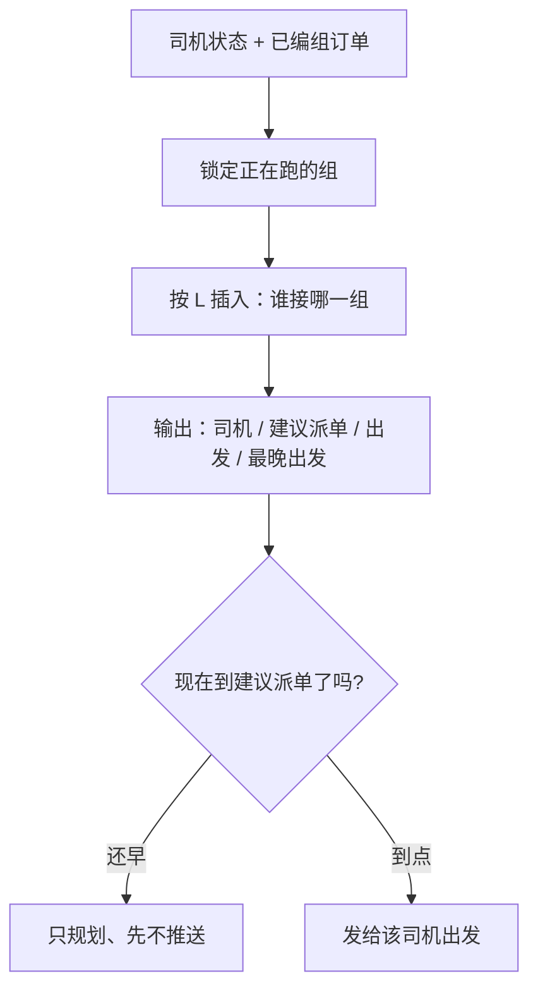

# 运力派单MVP

前置已经有了**组、次序、每组预估时间**。这里只做一件事：在司机当前状态下，决定**谁去接/送哪一组客人**，以及**什么时刻把单发给司机最合适**。

全局一套模型，不再分「送机 / 接机 / 轮换」来切换不同的算法。三种只是组的方向不同、上一趟停的位置不同。

**给司机派单的单位是整组，不是组上单个客人。** 一组 = 一车 = 司机的一次接送任务。不会把组拆给两辆车，也不会把两组拼进同一趟。司机一天可以接龙多组（做完 G01组 再做 G06组等），每一组仍是独立的一次任务，站序原样执行。

```bash
本地测试
python3 run.py 默认贪心
python3 run.py --alns （ALNS回插）
python3 run.py --peak （临时高峰测试）
```

| 文件 | 作用 |
|------|------|
| `fleet_mvp/data/drivers.json` | 司机：姓名、车牌、GPS、正在跑哪一组、接或送 |
| `fleet_mvp/data/groups.json` | 同一天全部编组（早晨送机 + 白天轮换 + 晚上接机） |
| `fleet_mvp/data/groups_peak.json` | 高峰扎堆压力测试，算法不变 |

---

## 1. 输入

### 分组

`stops` 只写客人地址。中转站 T 不写入列表，由 `kind` 决定方向。

| | 送机 `to_station` | 接机 `from_station` |
|--|-------------------|---------------------|
| 路线 | A - B - C - T | T - A - B - C |
| 每位客人 `eta` | 预估**接客**时刻 | 预估**送达**时刻 |
| 每位客人 `late` | 最晚接客（硬约束） | 最晚送达（硬约束） |
| 每位客人还有 | 地址名称、经纬度、人数、行李 | 同左 |

司机必须按站序把**整组跑完**。L 按每一位客人的时刻累计，不是只看第一户。全程行驶和停靠写入结束时刻，下一单从那里接龙。派单时整组插入或整组放下，站序和客人名单都不改。

### 司机

姓名、车牌、车辆 GPS、`current_gid`、接或送、`free_at`，以及 **`on_shift`（是否上班）**、**`shift_start` / `shift_end`（班次）**。

选定司机、计算 L **之前**先过班次门：`on_shift=false`（休息/下班）的人直接不进模型；班次还没开始的等到上班再出发；这组第一位客人已经晚于下班、或人已过下班点才出发，也不进候选。班内出发、下班后才收车的**仍分派**，输出打【加班】，L 里加加班分钟（有班内能收车的人会优先）。

- 空闲（含刚送完/接完、车上没人）：下一单从 **GPS** 出发。
- 运送中：下一单从 **本趟终点** 出发（送机终点 = T，接机终点 = 最后一户），时刻是预计到达终点的 `free_at`（若早于上班则等到上班）。正在跑的组锁定，不能改派。

选最佳司机时，在**当班且赶得上这组**的人里比 L：包括空闲的，也包括运送中、收车后仍在班次内能接的。不在班的人不会出现在比选里。

---

## 2. 模型

只有**一套**损失模型，名字都叫 L，但是分两层：

| 写法 | 算的是什么 | 现场对应 |
|------|------------|----------|
| \(L(d,g)\) | **一单**的分：把组 \(g\) 派给司机 \(d\) 亏多少 | 「G02 给佐藤划不划算」 |
| \(L(\text{方案})\) | **整张派单表**的分：所有已派的 \(L(d,g)\) 加起来，再加上没人接的罚 | 「今天这 22 组这样分，总账好不好」 |

真正优化的是第二层：\(\text{方案}^*=\arg\min L(\text{方案})\)。  
第一层是积木：没有 \(L(d,g)\)，加不出总账。贪心 / ALNS 只是在搜「总账更小的分法」，不另搞一套公式。

一单怎么打分：

\[
L(d,g)=\theta_e\,t_{\text{空驶}}+\theta_u\,k_{\text{不顺路}}+\theta_\delta\,t_{\text{晚点}}+\theta_w\,t_{\text{空等}}+\theta_r\,r_{\text{松弛}}
\]

整张表怎么加总：

\[
L(\text{方案})=\sum_{\text{已派}}L(d,g)+\sum_{\text{未派}}(\theta_{\text{miss}}+\theta_p\cdot\text{人数})
\]

赶不上任一客人的 `late`，或超载：这一单 \(L(d,g)=\infty\)，这个司机直接出局。  
若某组谁都接不了，它进「未派」，用很大的 \(\theta_{\text{miss}}\) 罚进总账（宁可绕一点也要先有人接）。

组内载客路段（A - B - C 或 T - A - B）对谁来跑都一样，**公里不进 \(L(d,g)\)**。它通过「后面几户会不会晚」和「这趟何时结束、能否接下单」起作用。

空驶起点：

| 上一趟结束 - 下一单 | 空驶 | 实际场景 |
|---------------------|------|----------|
| 送机 - 送机 | T - 下一组首个酒店 | 早晨连续送机 |
| 送机 - 接机 | T - T，≈ 0 | 白天到站直接接 |
| 接机 - 接机 | 上一户 - T | 晚上送到再回站 |
| 接机 - 送机 | 上一户 - 下一酒店，同址 ≈ 0 | 白天送到就地再送 |

---

## 3. 每个因素对应什么业务考虑
权重可以初始跑几轮找个合适的值，但注意的是越不能容忍的权重就要越大

| 模型因素 | 权重 | 怎么算 | 现场在考虑什么 |
|----------|------|--------|----------------|
| **空驶** | 1.2 | origin 空车开到「这单开始载客的点」的分钟 | 放空油耗、运力被空车占着。送机 = 去酒店接人；接机 = 赶回 T 接刚下大巴的人 |
| **不顺路** | 2.0 | 只对送机：绕去酒店再去 T，比直奔 T 多走的公里；接机 = 0 | 为接这组是否反向折返，伤体验也伤下一趟衔接 |
| **晚点** | 6.0 | **每一位**客人：实际到达 − 该址预估，求和 | 送机 = 客人已按 ETA 在酒店等；接机 = 客人按 ETA 等进房。第一户晚到会把后面整段推晚 |
| **空等** | 3.0 | **每一位**：早到分钟，求和 | 车过早趴在酒店门口或站里，干耗运力，也让司机抱怨 |
| **松弛不足** | 0.8 | 每一位距自己最晚时刻不足 8 分钟的部分，求和 | 还没晚点，但卡在最晚边缘，路况一堵就违约 |
| **加班** | 2.0 | 班内出发、下班后才收车的超时分钟 | 仍分派，输出【加班】；有班内能收车的人会优先 |
| **未派组 / 人数** | 10000 / 80 | 放下的组数和人数 | 覆盖率、运力缺口。先保证有人接，再抠空驶 |
| **\(L=\infty\)** | — | 超载、任一站超过 `late`、已下班才出发 | 这个司机根本不是候选人 |

调大某一项 θ = 更不能容忍对应那项现场问题。

---

## 4. 什么时机发给司机

规划可以提前做；**真正推送给司机**按准时出发，避免人在酒店空等。

```
建议出发 = max(司机可出发时刻, 赶到首点 ETA 所需的最晚出发)
建议派单 = 建议出发 − 5 分钟准备
最晚出发 = 再晚出发，组内就会有人超过自己的 late
```

- **太早发**：司机立刻走，到了第一户（或到了 T）还要干等，空等进 L，车也接不了别的组。
- **太晚发**：超过最晚出发，\(L=\infty\)，这单接不上。
- **合适**：08 : 07 出发、08 : 08 接到第一人；或 17 : 58 离开 T、18 : 05 送到第一户。发给司机比出发早 5 分钟，留出看导航、发动的时间。

送机「路上」= origin - 首个酒店。  
接机「路上」= origin - T，在 T 上车后再去第一户。

---

## 5. 总流程



---

## 6. 场景一：送机（酒店 - T）

早晨几乎全是送机。客人从各自酒店上车，按编组顺序接到中转站。

**示例组 G02**（难波早班）

| 客人 | 地址 | 预估接客 | 最晚接客 |
|------|------|----------|----------|
| 2 人 | 难波A | 08:08 | 08:30 |
| 2 人 | 心斋桥 | 08:18 | 08:45 |
| — | 中转站 T | 组内终点 | — |

路线：`难波A - 心斋桥 - T`。司机要跑完全程（本例载客约 22 分钟，08:30 到 T），不是接到难波A 就结束。心斋桥的接客时刻也进 L。

**谁来接：佐藤（D2，大阪500あ22-22）**

08:00 他空闲在难波，离难波A 只有约 0.2 km。

| 候选人 | L | 现场原因 |
|--------|---|----------|
| **佐藤** | **13.0** | 空驶 0.3 分钟；准点到难波A；途经心斋桥略早到（空等计入全程） |
| 伊藤 | 104.3 | 人在新大阪，空驶 17 分钟，首站晚约 14 分钟，后面也被推晚 |
| 鈴木 | 221 | 还在跑天王寺 G03，08:25 才到 T，整组严重晚点 |
| 田中 / 高橋 | ∞ | 插进他们已有的早晨任务后，赶不上 G02 的最晚接客 |

所以这单必须给佐藤：就近、能准点跑完 A-B-T。

**何时发给佐藤**

| 时刻 | 含义 |
|------|------|
| 08:02 | **建议派单**：这时推送到司机端 |
| 08:07 | **建议出发**：从难波 GPS 开车 |
| 08:08 | 到达难波A = 预估接客，第一户不空等 |
| 08:18 前后 | 接到心斋桥（组内第二户，时刻进 L） |
| 08:29 | **最晚出发**：再晚，难波A 会超过 08:30 |
| 08:30 | 到 T，下一单从 T 算 |

08:00 就发单让他立刻走，会在酒店门口空耗。08:29 之后再发，这组接不上。**08:02 发、08:07 走**是窗口里合适的点。

同一早晨，田中跑完梅田 G01 停在 T 后，再接中崎町 G06：空驶 **T - 酒店 5.5 km**，建议 09:23 发单、09:28 出发、09:40 接到。这就是「送完回站、再出去接下一批」——仍是同一套 L，只是 origin 变成了 T。

---

## 7. 场景二：接机（T - 酒店）

晚上几乎全是接机。客人在中转站上车，按编组顺序送到各自酒店。

**示例组 J32**（难波晚班）

| 客人 | 地址 | 预估送达 | 最晚送达 |
|------|------|----------|----------|
| 2 人 | 难波C | 18:05 | 18:30 |
| 2 人 | 道顿堀 | 18:12 | 18:40 |

路线：`T - 难波C - 道顿堀`。司机从上一趟终点空驶回 T（若已在 T 则空驶为 0），在站内上车，再按顺序送达。两位的送达时刻都进 L。

**谁来接：高橋（D4，大阪500あ44-44）**

他白天最后一趟送机已经停在 T，接 J32 空驶为 0。

| 候选人 | L | 现场原因 |
|--------|---|----------|
| **高橋** | **2.4** | 人已在 T，空驶 0；18:05 准点送到难波C |
| 伊藤 | 2.4 | 同样已在 T，L 相同；高橋因任务链更合适接上 |
| 田中 | 6.1 | 上一户不在 T，要先空驶约 3 分钟回站 |
| 鈴木 | 9.0 | 回站空驶更长 |
| 佐藤 | 15.6 | 上一趟停在更遠的酒店，空驶回 T 约 11 分钟 |

接机不记「不顺路」（出站送人是本职）。比的是：**谁回 T 更近、谁能赶上每一位的送达。**

**何时发给高橋**

| 时刻 | 含义 |
|------|------|
| 17:53 | **建议派单** |
| 17:58 | **建议出发**（人已在 T，几乎就是准备上车） |
| 18:05 | 送到难波C = 预估送达 |
| 18:12 前后 | 送到道顿堀 |
| 18:23 | **最晚出发**；再晚，难波C 会超过 18:30 |
| 18:17 | 本趟结束在道顿堀，下一单若还是接机，要空驶回 T |

17:30 就拉他在站里干等半小时，空等进 L。18:23 之后发，第一户送达会破最晚。**17:53 发、17:58 走**合适。

他下一单 J34（新大阪接机）就是典型的接机 - 接机：从道顿堀空驶回 T，再 T - 新大阪。建议出发会按「回站时间 + 站内上车 + 赶到第一户 ETA」反推，仍然早发会空等、晚发会晚点。

---

## 8. 场景三：接送轮换

白天送机、接机交错。模型要抓的是 **空驶 ≈ 0 的衔接**。

**示例：田中同一条任务链上的 J01 - G11**

先看 **J01 接机**（T - 福島酒店，预估送达 13 : 45，最晚 14 : 05）。

田中早晨连续送机后停在 T（G01 08 : 39 到站，又跑了 G06、G08）。13 : 45 的接机对他空驶为 0。

| 时刻 | 动作 |
|------|------|
| 13:28 | **建议派单**（不要上午就发，否则在 T 空等两小时） |
| 13:33 | **建议出发** / 在 T 接人 |
| 13:45 | 送到福島 = 预估送达 |
| 13:50 | 本趟结束，人就在福島酒店门口 |
| 13:53 | 最晚出发（对应 14:05 最晚送达） |

紧接着 **G11 送机**（同一家福島酒店，预估接客 14 : 15，最晚 14 : 40）。

| 候选人 | L | 现场原因 |
|--------|---|----------|
| **田中** | **0** | 刚把 J01 送到这家酒店，空驶 0，14:15 就地接人去 T |
| 伊藤 | 9.6 | 要从别处空驶 8 分钟过来 |
| 佐藤 | 153 | 空驶且会晚约 23 分钟，后面也危险 |
| 鈴木 / 高橋 | ∞ | 当时任务链插不进 |

| 时刻 | 动作 |
|------|------|
| 14:10 | **建议派单** |
| 14:15 | **建议出发** = 预估接客（人已在店门口，不用提前开） |
| 14:15 | 接到客人 |
| 14:31 | 送到 T |
| 14:40 | 最晚出发 |

13 : 50 J01 刚结束就立刻发 G11，司机会在酒店门口空等 25 分钟。14 : 40 再发则赶不上。**14 : 10 发、14 : 15 走**合适。

这就是白天轮换：送到 T 直接接机（J01 空驶 0），接到酒店直接送机（G11 空驶 0）。同一套 L，没有切换「轮换模式」。

田中全天链（同一次运行）：

`G01 送机 - G06 送机（T 空驶回酒店） -  G08 送机 - J01 接机（空驶 0） -  G11 送机（空驶 0） -  J03 接机（空驶 0） -  …`

早晨的空驶、白天的零空驶、晚上再回 T，都在这一条链上。

---

## 9. 目录

```
fleet_mvp/
  run.py         入口（默认贪心；--alns 再搜）
  loss.py        损失 L（核心模型）
  execute.py     按 kind 走完全程每一位，接龙用上一趟终点
  assign.py      贪心 + ALNS 搜索 argmin L
  models.py      司机 / 编组 / 方案
  geo.py         直线距离，这块可以换成我们的路网client接口或在线google
  config.py      配置项
  io_util.py     读 data/*.json预设的司机、客人分组等信息
  data/          drivers.json、groups.json、groups_peak.json
  test/          单测
```

## 10. 局限

- 行驶是直线 / 均速 28 km/h，不是咱们的路网或GOOGLE的ETA。
- 还没有「已发单冻结、其余按 GPS 滚动重派」的在线闭环，其实咱们这个派单是个引擎，要对接感知司机实时gps信息。
- 解释目前主要是胜出司机的 L 拆分；对照落选司机的原因需要再做成结构化输出。
- θ 是经验初值，要用线上准点、空驶、空等再标定。
- **班次已纳入候选门。** `on_shift=false` 的人不进 L；上班内出发、下班后收车会派并标【加班】。忙闲均衡仍未做。